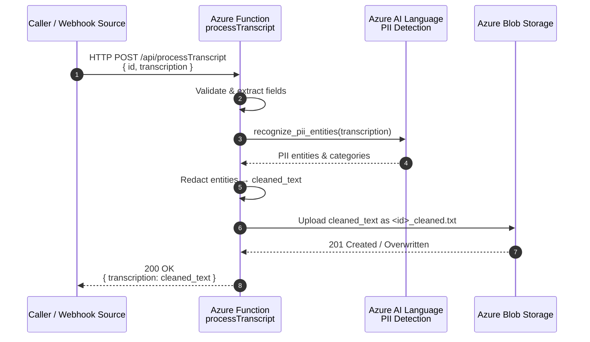

# Solution Overview

This project provides an Azure Functions HTTP endpoint that receives call transcript payloads, performs PII (Personally Identifiable Information) redaction using Azure AI Language (Text Analytics PII detection), and stores a cleaned version of the transcript in Azure Blob Storage for downstream consumption or archival.

---
## High-Level Flow
1. External system (e.g., CallRail webhook) sends an HTTP POST request containing a JSON payload with an `id` and `transcription`.
2. The Azure Function (`processTranscript`) validates and parses the payload.
3. The transcription text is passed to Azure AI Language PII detection (required — no fallback logic present).
4. Detected PII entities are redacted and replaced with labeled placeholders (e.g., `[REDACTED_EMAIL]`, `[REDACTED_PHONE]`, `[REDACTED_PERSON]`).
5. The cleaned transcript is saved as `<id>_cleaned.txt` inside the Blob Storage container `cleaned-transcriptions`.
6. The function returns an HTTP 200 response with a JSON body: `{ "transcription": "<cleaned_text>" }`.

---
## Mermaid Sequence Diagram


---
## Components
| Component | Purpose |
|-----------|---------|
| Azure Function (Python) | Stateless HTTP endpoint performing orchestration & response generation |
| Azure AI Language (Text Analytics) | Detects PII entities in natural language text |
| Azure Blob Storage | Persists redacted transcript files (`cleaned-transcriptions` container) |
| Azurite (Local Dev) | Local emulator for Blob Storage during development |

---
## Key Files
| File | Description |
|------|-------------|
| `function_app.py` | Main function logic: HTTP handling, orchestration, blob upload |
| `pii_detection.py` | PII detection module using Azure AI Language service |
| `requirements.txt` | Python dependencies (Functions runtime, Blob SDK, AI Language SDK) |
| `local.settings.json` | Local environment configuration (emulator + AI service vars) |
| `requestPayload.json` | Sample request payload for manual testing |
| `tests/` | Test suite directory with endpoint and module tests |
| `AZURE_AI_SETUP.md` | Guide to configuring Azure AI Language service |
| `DEPLOY.md` | Deployment instructions using `azd` |
| `DESCRIPTION.md` | (This file) Architecture and flow overview |

---
## Environment Variables / App Settings
| Name | Description | Required | Notes |
|------|-------------|----------|-------|
| `AzureWebJobsStorage` | Storage account connection string (or Azurite dev string) | Yes | Required for Azure Functions + Blob SDK |
| `AZURE_AI_LANGUAGE_ENDPOINT` | Endpoint of Azure AI Language resource | Yes | Function returns 500 if absent |
| `AZURE_AI_LANGUAGE_KEY` | API key for Azure AI Language resource | Yes | Function returns 500 if absent |

---
## Redaction Strategy
The solution uses Azure AI Language `recognize_pii_entities` exclusively:
- Structured entity metadata (category, offset, length)
- Each entity replaced with `[REDACTED_<CATEGORY>]`
If the Azure AI Language call fails or configuration is missing, the function returns an error (500) instead of redacting.

---
## Error Handling & Resilience
| Scenario | Behavior |
|----------|----------|
| Missing `id` or `transcription` | 400 Bad Request with JSON error message |
| Invalid JSON | 400 Bad Request |
| AI Language failure | 500 error response (no fallback) |
| Storage connection missing | 500 error with diagnostic message |
| Blob upload failure | 500 error with generic persistence error |

---
## Logging
- Incoming request receipt
- Azure AI Language usage and entity count
- Errors for missing credentials (results in 500)
- Errors for storage or AI service failures (stack traces logged server-side)

---
## Extensibility Ideas
| Enhancement | Approach |
|-------------|---------|
| Return structured list of redacted entities | Add array to response with categories & original spans (safely) |
| Versioned transcripts | Store under `cleaned-transcriptions/<id>/<timestamp>.txt` |
| Additional compliance filters | Chain content policy modules pre/post PII removal |
| Event-driven processing | Emit Event Grid notification after successful upload |
| Storage tiering | Configure lifecycle policies for archive after N days |

---
## Local Development Quick Start
```bash
# 1. Start Azurite (in a separate terminal)
azurite --location ./azurite --debug ./azurite/debug.log

# 2. Install deps
python -m venv .venv
source .venv/bin/activate
pip install -r requirements.txt

# 3. (Optional) Set real AI credentials
export AZURE_AI_LANGUAGE_ENDPOINT="https://<your-lang>.cognitiveservices.azure.com/"
export AZURE_AI_LANGUAGE_KEY="<your-key>"

# 4. Run function host
func host start

# 5. Test endpoint
curl -X POST http://localhost:7071/api/processTranscript \
  -H "Content-Type: application/json" \
  -d @requestPayload.json | jq

# Or use the test suite
cd tests && python test_function.py
```

---
## Security Considerations
- Avoid logging raw sensitive transcript content in production.
- Prefer using Managed Identities instead of API keys where supported (future improvement).
- Apply network restrictions (VNet / Private Endpoints) for production deployments.
- Rotate `AZURE_AI_LANGUAGE_KEY` regularly (store in Azure Key Vault + reference via app settings).

---
## Limitations
- Large transcripts may incur higher latency or API usage costs.
- Current implementation overwrites existing `<id>_cleaned.txt` (no versioning).
 - Requires valid Azure AI Language credentials to function.

---
## Future Improvements
- Batch processing for multi-part transcripts
- Add retry logic with exponential backoff for transient failures
- Stream-based PII detection for very large inputs
- Structured entity metadata returned alongside cleaned text

---
**End of Document**
